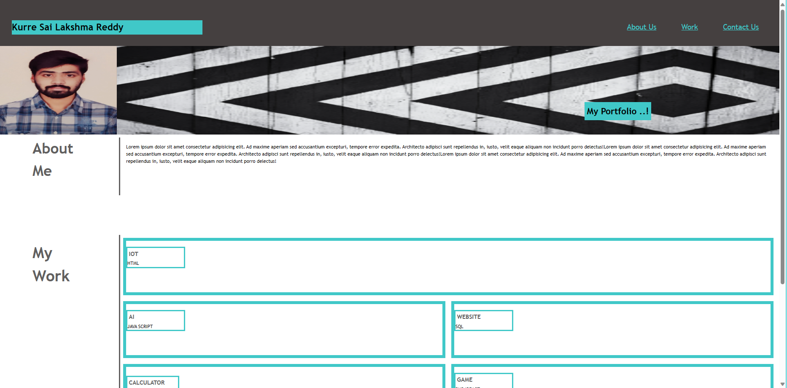
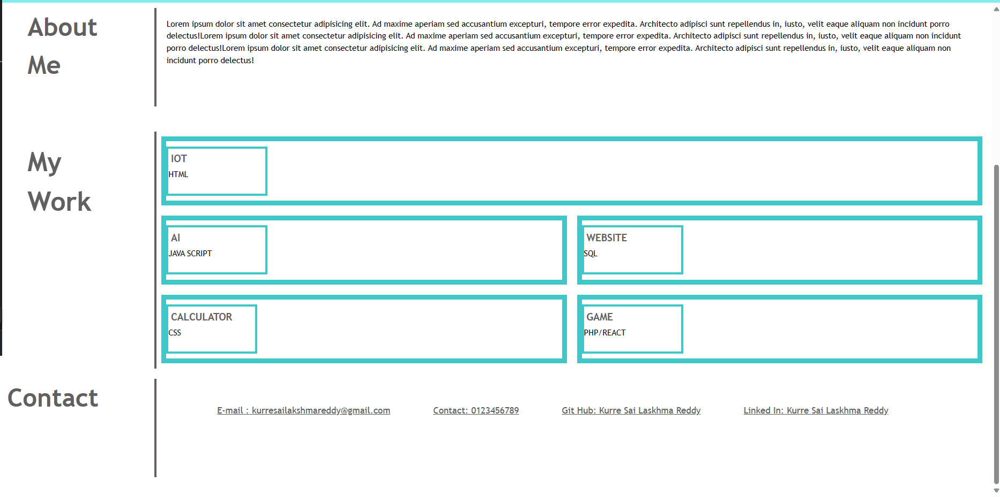

# edxbootcamp_Module2challenge2


## Description

This module challege is to create a protfolio website to show case the skills and talents to fill a 
part-time of full-time.

## Task needed to achieve this module

* When the page is loaded the page presents your name, a recent photo or avatar, and links to sections about you, your work, and how to contact you

* When one of the links in the navigation is clicked then the UI scrolls to the corresponding section

* When viewing the section about your work then the section contains titled images of your applications

* When presented with the your first application then that application's image should be larger in size than the others

* When images of the applications are clicked then the user is taken to that deployed application

* When the page is resized or viewed on various screens and devices then the layout is responsive and adapts to my viewport


## Installation

N/A

## Usage 

N/A

## Output of the website

```md


```


## Link to deployed application

(https://kurresailakshmareddy.github.io/edxbootcamp_Modulechallenge1/)

## License

none


